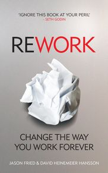
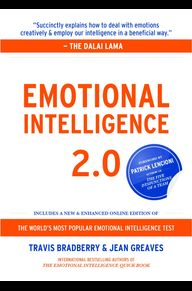
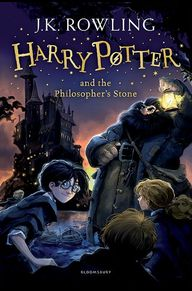
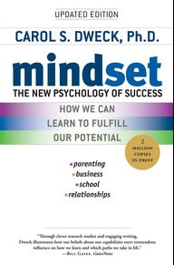

Books I've read in 2019.

 
<!-- always 1 minus from total -->
📱 read from mobile (0)
📖 read from book (5)
 
 

## 5. The Murder of Roger Ackroyd - Agatha Christie (📖)

 

**Rating 10/10**

Finished on : 19-Oct-2019

 

---

## 4. Rework - Jason Fried and David Heinemeier Hansson (📖)

 

**Rating 8.5/10**

Finished on : 5-Sep-2019

 

---

## 3. Emotional Intelligence 2.0 - Travis Bradberry (📖)

 

**Rating 9/10**

Finished on : 13-June-2019

 

---

## 2. Harry Potter and The Philosophers Stone - JK Rowling (📖)

 

**Rating 10/10**

Finished on : 11-May-2019

 

---

## 1. Mindset - Carol Dweck (📖)

 

**Rating 10/10**

Finished on : 28-April-2019

my reading-notes [Mindset - Carol Dweck](https://alamgirqazi.github.io/blog/Mindset)

 

---

