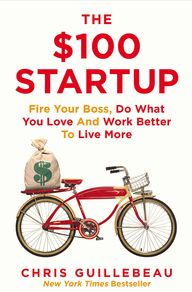
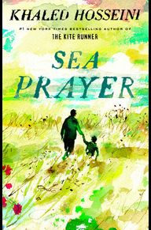
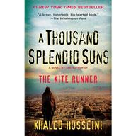
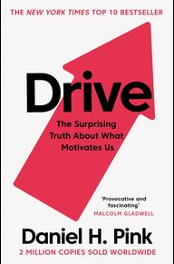
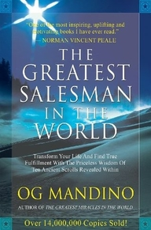

Books I've read in 2020.

 
<!-- always 1 minus from total -->
📱 read from mobile (0)
📖 read from book (5)
 
 

## 1. The \$100 Startup - Chris Guillebeau (📖)

 

**Rating 9/10**

Finished on : 6-June-2020

my reading-notes [The $100 Startup - Chris Guillebeau(https://alamgirqazi.github.io/blog/$100Startup)

 

---

## 2. Sea Prayer - Khaled Hosseini (📖)

 

**Rating 9/10**

Finished on : 6-June-2020

 

---

## 3. A Thousand Splendid Suns - Khaled Hosseini (📖)

 

**Rating 10/10**

Finished on : 18-April-2020

 

---

## 4. Drive - Daniel Pink (📖)

 

**Rating 9/10**

Finished on : 28-March-2020

my reading-notes [Drive - Daniel Pink](https://alamgirqazi.github.io/blog/Drive)

 

---

## 5. The Greatest Salesman In The World - Og Mandino (📖)

 

**Rating 8.5/10**

Finished on : 23-March-2020

my reading-notes [The Greatest Salesman In The World - Og Mandino](https://alamgirqazi.github.io/blog/GreatestSalesmanInTheWorld)

 

---
