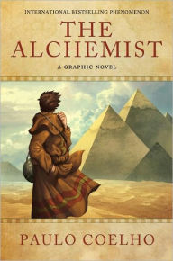
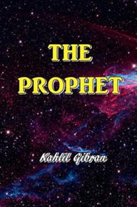
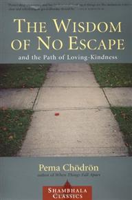

<!--   -->

## Don't Sweat The Small Stuff - Richard Carlson

 

**Rating 10/10**

 

"Life Isn't an Emergency." The idea is that life is not very complicated unless
we make it. By incorporating virtues such as acceptance and gratitude, we can
live a happy and fulfilled life. Easily the best self-help book out there. See
my reading-notes

[Don't Sweat The Small Stuff - Richard Carlson](https://alamgirqazi.github.io/blog/DontSweatTheSmallStuff)

## 1984 - George Orwell

 

**Rating 10/10**

 

## Daring Greatly - Brene Brown

 

**Rating 10/10**

 

Definitely a Life-changing book for me. Brene Brown has been an inspiration. Her
two books (this one and "The Gifts of Imperfection") are definitely must read
for everyone. Brene Brown talks about the difficulties that we face everyday and
how we can overcome problems such as vulnerability and shame. See my
reading-notes
[Daring Greatly - Brene Brown](https://alamgirqazi.github.io/blog/DaringGreatly)

## The Gifts of Imperfection - Brene Brown

 

**Rating 10/10**

 

What a splendid and mindblowing book. Superb research by Brene Brown on how we
can cultivate more in life by showing courage, compassion and cultivating
connection. See my reading-notes
[The Gifts of Imperfection - Brene Brown](https://alamgirqazi.github.io/blog/TheGiftsofImperfection)

## Muhammad - Karen Armstrong

 

**Rating 10/10**

 

A brief and an excellent account written on the life of Holy Prophet(PBUH). This
book covers all the major events from his birth to his death.

## Pir e Kamil - Umera Ahmed

 

**Rating 10/10**

 

This is truly a fantastic fiction novel. The character development is just
sublime. This book really shocked me.

## How to Win Friends and Infuence People

 

**Rating 10/10**
 

This book is a top 5 favourite of most of my mentors and now I know why. A
breathtaking and a magnificient read. Everything about this book is pitch
perfect. See my reading-notes
[How to Win Friends and Infuence People - Dale Carnegie](https://alamgirqazi.github.io/blog/HowToWinFriendsandInfluencePeople)

## The Subtle Art of Not Giving a F\*ck - Mark Manson

 

**Rating 10/10**

 

A really phenomenal book. Mark Manson has packaged all the self-help in a very
provocative read. Arguably the best self-help book out there. See my
reading-notes
[The Subtle Art of Not Giving a F\*ck - Mark Manson](https://alamgirqazi.github.io/blog/MarkManson)

## The Monk Who Sold His Ferrari

 

**Rating 10/10**
 

Astonishing. Stupendous. Remarkable. This book will really blow your mind. See
my reading-notes
[The Monk Who Sold His Ferrari - Robin Sharma](https://alamgirqazi.github.io/blog/TheMonkWhoSoldHisFerrari)

## And Then There Were None - Agatha Christie

 

**Rating 10/10**

 

What a thriller. Definitely my favourite fiction novel.

## The Kite Runner - Khaled Hosseini

 

**Rating 10/10**

 

One of my favourite fiction book ever. What an electrifying read from start to
finish.

## The Catcher in the Rye - JD Salinger

 

**Rating 10/10**

 

This book nearly killed me. A true classic.

## The Book Thief - Markus Zusak

 

**Rating 10/10**

 

Easily among the most well-written books I've read alongside 'The Catcher in the
Rye'. A very gripping and intense novel with full of emotions.

## 5 Major Pieces To The Life Puzzle - Jim Rohn

 

**Rating 9.5/10**

 

"Success is a condition that must be attracted and not pursued. We achieve
rewards and we make progress not by our intense pursuits, but by what we
become." Classic self-help book from Jim Rohn. Plenty of insights in this book
on how to become a better version of yourself. Alot of this stuff I read in the
book "The Compound Effect" by Darren Hardy. Jim Rohn was a mentor of Darren
Hardy. See my reading-notes
[5 Major Pieces To The Life Puzzle - Jim Rohn](https://alamgirqazi.github.io/blog/5MajorPiecesToTheLifePuzzle)

## The Magic of Thinking Big - David Schwartz

 

**Rating 9.5/10**

 

This is a wonderful self-help book. Your thinking matters more than you realize. It's a comparatively longer read but still doesn't feel repititive at all. See my reading-notes
[The Magic of Thinking Big - David Schwartz](https://alamgirqazi.github.io/blog/TheMagicOfThinkingBig)

## Rising Strong - Brene Brown

 

**Rating 9.5/10**

 

Another amazing book from Brene Brown. This book includes alot more real life
experiences of Brene and her family and how she dealth with self-righteousness
and Integrity in her own life.
[Rising Strong - Brene Brown](https://alamgirqazi.github.io/blog/RisingStrong)

## Animal Farm - George Orwell

 

**Rating 9.5/10**

 

## Steal Like An Artist - Austin Kleon

 

**Rating 9.5/10**

 

Excellent little book which I completed in a day. A very inspiring book for all
creative people. Austin stresses on just doing what you want to do everyday and
forget about trying to be completely original because nothing is completely
original. See my reading-notes
[Steal Like An Artist - Austin Kleon](https://alamgirqazi.github.io/blog/StealLikeAnArtist)

## Too Soon Old Too Late Smart - Gordon Livingston

 

**Rating 9.5/10**

 

I read a summary of this book at sivers.org and its probably the one that got me
into reading books. I didn't had a copy of this book until recently so I had to
wait a while to complete this book. Absolutely sensational read. There is just
so much about this book that just hits you. See my reading-notes
[Too Soon Old Too Late Smart - Gordon Livingston](https://alamgirqazi.github.io/blog/TooSoonOldTooLateSmart)

## The Compound Effect - Darren Hardy

 

**Rating 9.5/10**

 

A very interesting self-help book. Darren Hardy says that we can make huge
breakthroughs by making very small subtle changes in our life. These small
changes compound over time to bring massive improvements in our lives. See my
reading-notes
[The Compound Effect - Darren Hardy](https://alamgirqazi.github.io/blog/TheCompoundEffect)

## Who Moved My Cheese - Spencer Johnson

 

**Rating 9.5/10**

 
“Life is no straight and easy corridor along which we travel free and unhampered, but a maze of passages, through which we must seek our way, lost and confused, now and again checked in a blind alley. But always, if we have faith, a door will open for us, not perhaps one that we ourselves would ever have thought of, but one that will ultimately prove good for us.” ~ A. J. Cronin. See my reading-notes [Who Moved My Cheese - Spencer Johnson](https://alamgirqazi.github.io/blog/WhoMovedMyCheese)

## The Obstacle Is The Way - Ryan Holiday

 

**Rating 9.5/10**

 

Another gold mine book from Ryan Holiday. Fantastic read. Plenty of stoic
philosophy in this book. I probably read this book at the perfect time because I
really needed this. See my reading-notes
[The Obstacle is the way - Ryan Holiday](https://alamgirqazi.github.io/blog/TheObstacleIsTheWay)

## Reinvent Yourself - James Altucher

 

**Rating 9.5/10**

 

I have learned so much more than James Altucher than anyone else. His blog posts
and Quora posts have had a huge impact on me. This book is equally good. It's
almost a composition of all of his best posts and blogs. James writes about the
things he learned from different people in different situations. See my
reading-notes
[Reinvent Yourself - James Altucher](https://alamgirqazi.github.io/blog/ReinventYourself)

## Think and Grow Rich - Napoleon Hill

 

**Rating 9.5/10**

 

A Sensational book. They really mean it when they say it's one of the best
Self-help book out there. See my reading-notes
[Think and Grow Rich - Napoleon Hill](https://alamgirqazi.github.io/blog/ThinkAndGrowRich)

## Ego is the enemy - Ryan Holiday

 

**Rating 9.5/10**

 

Ryan Holiday is one of the best writers out there. I love his blogs and
podcasts. This book from him is a masterpiece. Amazing insight on how to always
stay humble and keep your ego in control. Ryan really is an inspiration for the
new generation. See my reading-notes
[Ego is the Enemy - Ryan Holiday](https://alamgirqazi.github.io/blog/EgoIsTheEnemy)

## Looking For Alaska - John Green

 

**Rating 9.5/10**

 

John Green knows how to tear someone's heart. This book is even better than the
so famous 'The Fault in Our Stars'. Looking for Alaska is a stunningly beautiful
novel.

## When Breath becomes Air - Paul Kalanithi

 

**Rating 9/10**

 

I was in tears reading this book. Paul talks about what makes our lives
meaningful. Paul Kalanithi graduated in 2000 with a B.A. and M.A. in English
Literature from Stanford University and a B.A. in Human Biology. He earned an
M.Phil in History and Philosophy of Science and Medicine from the University of
Cambridge before attending Medical school. In 2007, Paul graduated cum laude
from the Yale School of Medicine. He returned to Stanford for residency training
in Neurological Surgery and a postdoctoral fellowship in neuroscience. In May
2013, Paul Kalanithi was diagnosed with metastatic stage IV lung cancer. Paul
was into his 6th year of Residency when he was diagnosed. He wrote this book on
his deathbed.

## Personal Development for Smart People - Steve Pavlina

 

**Rating 9/10**

 

Plenty of insight in this book. Steve Pavlina is one of the most famous bloggers
on Personal Development. This book is pretty much covers all areas of personal
development. It might seem a little lengthy and repititive at some stage but its
still worth reading. See my reading-notes
[Personal Development for Smart People - Steve Pavlina](https://alamgirqazi.github.io/blog/PersonalDevelopmentForSmartPeople)

## Tiny Beautiful Things - Cheryl Strayed

 

**Rating 9/10**

 

Cheryl Strayed is a wonderful writer and a brilliant story-teller who gives
advice enriched with compassion. This books contains letters and their answers
which Cheryl wrote in her column on an online site TheRumpus.net

## Quiet - Susan Cain

 

**Rating 9/10**

 

This is a must read book for Introverts. Susan Cain writes about introversion
and extroversion based on a lot of research and gives a detailed view on how to
live in a world that's made for extroverts. See my reading-notes
[Quiet - Susan Cain](https://alamgirqazi.github.io/blog/Quiet)

## Meditations - Marcus Aurelius

 

**Rating 9/10**

 

Marcus Aurelius was the Roman emperor and probably the most powerful man of his
time. This book is basically a collection of his journals which he wrote to
himself and weren't meant to be published. See my reading-notes
[Meditations - Marcus Aurelius](https://alamgirqazi.github.io/blog/meditations)

## So Good They Can't Ignore You - Cal Newport

 

**Rating 9/10**

 

Cal Newport has a PhD in Computer Science from MIT and is a Professor at
GeorgeTown University. Cal provides an amazing insight on how you should forget
about searching for passion and instead look to cultivate rare and valuable
skills. Cal debunks the myth of finding your passion and calls passion as
over-rated. Must read book for someone who is into their career or even starting
out. I'll probably have to re-read this book in a year. See my reading-notes
[So Good They Can't Ignore You - Cal Newport](https://alamgirqazi.github.io/blog/SoGoodTheyCantIgnoreYou)

## Turtles All The Way Down - John Green

 

**Rating 9/10**

 

Had great expectations and it didn't disappoint. Not as good as his other 2 best sellers but still a very great book. I love the depth of characters in John Green's novels. They're just fantastic.

## Man's Search for Meaning - Viktor Frankl

 

**Rating 9/10**

 

Viktor Frankl is a surviver of Nazi's concentration camp during the 2nd World
War. This book he wrote on his time at the camp and how he found meaning in his
life during all the suffering.

See my reading-notes
[Man's Search for Meaning - Viktor Frankl](https://alamgirqazi.github.io/blog/MansSearchForMeaning)

## Love Yourself Like Your Life Depends On It - Kamil Ravikant

 

**Rating 9/10**

 

An incredibly short read but still a fantastic book. The basic idea is that you
repeat "I love myself" over and over in your head as a mantra.\
See my reading-notes [Love Yourself Like Your Life Depends On It - Kamil Ravikant](https://alamgirqazi.github.io/blog/kamalravikant)

## Show Your Work - Austin Kleon

 

**Rating 9/10**

 

Another awesome book from Austin Kleon. See my reading-notes
[Show Your Work - Austin Kleon](https://alamgirqazi.github.io/blog/ShowYourWork)

## Zero To One - Peter Thiel

 

**Rating 9/10**

 

## This is Water - David Foster Wallace

 

**Rating 9/10**

 

liberal arts education is not so much about filling you up with knowledge as it
is about, quote, “teaching you how to think.” See my reading-notes
[This is Water - David Foster Wallace](https://alamgirqazi.github.io/blog/ThisIsWater)

## Emotional Intelligence - Daniel Goleman

 

**Rating 9/10**

 

Very Fascinating and absorbing research. Emotional Intelligence is indeed
extremely essential. See my reading-notes
[Emotional Intelligence - Daniel Goleman](https://alamgirqazi.github.io/blog/Emotionalintelligence)

## Anything You Want - Derek Sivers

 

**Rating 9/10**

 

Derek Sivers shares his amazing story of how he built CD Baby from scratch.
Derek explains his business model and why he didn't wanted his business to
expand or make too much money. He also made interesting comments like he'd
rather prefer being CEO of a company with 5 people than 85 people. CD baby was
sold for 22 million and had 85 employees at the time. See my reading-notes
[Anything You Want - Derek Sivers](https://alamgirqazi.github.io/blog/AnythingYouWant)

## Tuesdays with Morrie - Mitch Albom

 

**Rating 9/10**

 

A very soul-stirring and poignant book for me.

## The Alchemist - Paulo Coelho

 

**Rating 9/10**

 

A really fascinating story of Santiago who went out to search for hidden
treasure. The Journey is more important than the destination.

## Dairy of a Young Girl - Anne Frank

 

**Rating 9/10**

 

So much power, authenticity and audacity in this diary from Anne Frank. Her
self-knowledge for such a young person is absolutely incredible. This is a
fantastic and sad read. Anne Frank wrote this in hiding during World War 2. Her
family and few other friends who were hiding were found after 2 years in hiding
and sent to Nazi concentration camps. Only Anne Frank's father survived.

## The Prophet - Kahlil Gibran

 

**9/10**

 

A beautiful poetic book which was written way back in 1923. A little difficult
to read but definitely worth it. See my reading-notes
[The Prophet - Kahlil Gibran](https://alamgirqazi.github.io/blog/TheProphet)

## The Power of Giving - Azim Jamal and Harvey McKinnon

 

**9/10**

 

"The more you give of yourself, the more you find of yourself." See my reading-notes
[The Power of Giving - Azim Jamal and Harvey McKinnon](https://alamgirqazi.github.io/blog/ThePowerOfGiving)

## If I Stay - Gayle Forman

 

**9/10**

 

A gut-wrenching and heart-breaking story. An accident causes Mia to lose her
parents and her 8 year old brother Teddy. One day her choices were about whether
or not to join a music school and the next day she's fighting for survival.

## The Little Prince - Antoine de Saint-Exupe

 

**9/10**

 

## Fahrenheit 451 - Ray Bradbury

 

**9.5/10**

 

## Tell me your dreams - Sidney Sheldon

 

**Rating 9/10**

 

Amazeballs. Sidney Sheldon knows how to tell a story. This novel made me fall in
love with Fiction.

## A Short Guide To A Happy Life - Anna Quindlen

 

**Rating 9/10**

 

"You just need to get a life, a real life, a full life, a professional life,
yes, but another life, too."

## The Fault In Our Stars - John Green

 

**9/10**

 

An excellent emotional book by John Green. The thing that I grasped from the
book was you don't have to matter to a lot of people. You don't have to be
famous and loved by everyone to achieve a meaningful life.

## The Notebook - Nicholas Sparks

 

**Rating 9/10**

 

A very compelling love story with intricate details and very well conveyed.

## The Mastery of Love - Don Miguel Ruiz

 

**Rating 9/10**

 
You have to focus on the most wonderful relationship you can have: the relationship with yourself. It is not about being selfish; it is about self-love. These are not the same. See my reading-notes [The Mastery of Love - Don Miguel Ruiz](https://alamgirqazi.github.io/blog/TheMasteryofLove)

## Ignore Everybody - Hugh McLeod

 

**Rating 8.5/10**

 

Hugh talks about being creative and always having a side-hobby apart from your
work. His message is to work hard, be patient, be polite and don't just do it
for the money. See my reading-notes
[Ignore Everybody - Hugh McLeod](https://alamgirqazi.github.io/blog/IgnoreEverybody)

## Hunger - Roxane Gay

 

**Rating 8.5/10**

 

There is so much truth in the book and that makes it incredibly hard to read.
I've never read a more vulnerable memoir ever before. Roxane shares her
heartbreaking but painfully accurate stories which no ordinary person would be
ever willing to share.

## Free Will - Sam Harris

 

**Rating 8.5/10**

 

"Free will is an illusion. Our wills are simply not of our own making. Thoughts
and intentions emerge from background causes of which we are unaware and over
which we exert no conscious control. We do not have the freedom we think we
have." See my reading-notes
[Free Will - Sam Harris](https://alamgirqazi.github.io/blog/FreeWill)

## Very Good Lives - JK Rowling

**Rating 8.5/10**

 
JK Rowling talks about her failures and says that you're qualification isn't who you are and how Imagination is the real power. See my reading-notes [Very Good Lives - JK Rowling](https://alamgirqazi.github.io/blog/VeryGoodLives)

## Rich Dad Poor Dad - Robert Kiyosaki

 

**Rating 8.5/10**

 

Very Instructive and compelling read.

## Outliers | The Story of Success - Malcolm Gladwell

 

**Rating 8.5/10**

 

A very spectacular read indeed. The concept of outliers is truly astonishing.

## The Tipping Point - Malcolm Gladwell

 

**Rating 8/10**

 

A very riveting concept on how some things get so ubiquotous and some don't.

## Good to Great - Jim Collins

 

 

Jim Collins has done an outstanding research on how some companies transitioned
from good to great while some stayed mediocre or regressed.

## Siddhartha - Hermann Hesse

 

**Rating 8/10**

 

## Thinking, Fast and Slow - Daniel Kahneman

 

currently reading

Rating (coming soon)

 

## Jane Eyre - Charlotte Bronte

 

currently reading

 

## Elon Musk - Ashlee Vance

 

currently reading

<!-- **Rating (coming soon)**  -->

 

## Stumbling on Happiness - Daniel Gilbert

 

currently reading

 

## Muhammad - Martin Lings

 

<!-- currently reading -->

<!-- **Rating (coming soon)**  -->

 

# Up next in reading list

## Gone Girl - Gillian Flynn

 

<!-- **Rating (coming soon)**  -->

 

## Hiroshima - John Hersey

 

<!-- currently reading -->

<!-- **Rating (coming soon)**  -->

 

## Middlemarch - George Eliot

 

<!-- **Rating (coming soon)**  -->

 

## Mein Kampf - Adolf Hitler

 

<!-- **Rating (coming soon)**  -->

 

## 4 Hour Work Week - Tim Ferriss

 

<!-- **Rating (coming soon)**  -->

 

## Mindwise - Nicholas Epley

 

<!-- **Rating (coming soon)**  -->

 

## Influence | The Psychology of Persuasion - Robert Cialdini

 

<!-- currently reading -->

<!-- **Rating (coming soon)**  -->

 

## The Da Vinci Code - Dan Brown

 

<!-- **Rating (coming soon)**  -->

 

## A Thousand Splendid Suns - Khaled Hosseini

 

<!-- **Rating (coming soon)**  -->

 

## To Kill A Mockingbird - Harper Lee

 

<!-- **Rating (coming soon)**  -->

 

## The Maze Runner - James Dashner

 

<!-- **Rating (coming soon)**  -->

 

## The Power Of Now - Eckhart Tolle

 

<!-- **Rating (coming soon)**  -->

 

## When Things Fall Apart - Pema Chodron

 

<!-- **Rating (coming soon)**  -->

 

## The Wisdom of No Escape - Pema Chodron

 

<!-- **Rating (coming soon)**  -->

 

## Don't Sweat The Small Stuff In Love - Richard Carlson

 

<!-- **Rating (coming soon)**  -->

 

