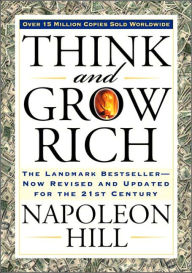
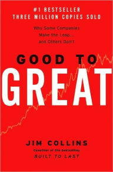

<!--

  Hey therefefsdf! This page is included as an example. Feel free to customize it for your own use upon downloading. Carry on!

 -->

### How to Win Friends and Infuence People

Rating 10/10   

 This book is a top 5 favourite of most of my mentors and now I know why. A breathtaking and a magnificient read. Everything about this book is perfect.
 See my reading-notes [How to Win Friends and Infuence People - Dale Carnegie](https://alamgirqazi.github.io/blog/HowToWinFriendsandInfluencePeople)

 
### The Monk Who Sold His Ferrari

Rating 10/10  

Astonishing. Stupendous. Remarkable. This book will really blow your mind. See my reading-notes [The Monk Who Sold His Ferrari - Robin Sharma](https://alamgirqazi.github.io/blog/TheMonkWhoSoldHisFerrari)

 

### The Subtle Art of Not Giving a F*ck - Mark Manson

Rating 9.5/10

A really phenomenal book. I've listened to a few of Mark Manson's podcasts and videos and read some of this articles and this guy is good. Like really, really good. 
See my reading-notes [The Subtle Art of Not Giving a F*ck - Mark Manson](https://alamgirqazi.github.io/blog/MarkManson)

 

### Think and Grow Rich - Napoleon Hill

Rating 9.5/10

A Sensational book. They really mean it when they say it's one of the best Self-help book out there.
See my reading-notes [Think and Grow Rich - Napoleon Hill](https://alamgirqazi.github.io/blog/ThinkAndGrowRich)

 

### Ego is the enemy - Ryan Holiday

Rating 9.5/10

Ryan Holiday is one of the best writers out there. I love his blogs and podcasts. He's the first person to introduce the stoic philosophy to me. This book from him is a masterpiece. Amazing insight on how to always stay humble and keep your ego in control. Ryan really is an inspiration for the new generation. 
See my reading-notes [Ego is the Enemy - Ryan Holiday](https://alamgirqazi.github.io/blog/EgoIsTheEnemy)

 

### Tuesdays with Morrie - Mitch Albom

Rating 9/10

A very soul-stirring and poignant book for me.

 

### The Alchemist - Paulo Coelho

Rating 9/10

A really fascinating story of Santiago who went out to search for hidden treasure. The Journey is more important than the destination.

 

### Tell me your dreams - Sidney Sheldon

Rating 9/10

Amazeballs. Damn Sidney Sheldon knows how to tell a story. This novel made me fall in love with Fiction.

 
### Emotional Intelligence - Daniel Goleman

Rating 8.5/10  

Very Fascinating and absorbing research. Emotional Intelligence is indeed extremely essential.

 

### Rich Dad Poor Dad - Robert Kiyosaki

Rating 8.5/10  

Very Instructive and compelling read.

 

### Outliers | The Story of Success - Malcolm Gladwell

Rating 8.5/10

A very spectacular read indeed. The concept of outliers is truly astonishing.

 

### The Tipping Point - Malcolm Gladwell

Rating 8/10

A very riveting concept on how some things get so ubiquotous and some don't.

 

### Dairy of a Wimpy Kid - Jeff Kinney

Rating 8/10  

A funny little book.

 

### Good to Great - Jim Collins

Rating (coming soon)

 

<!-- ### The Five People You Meet In Heaven - Mitch Albom

Rating (coming soon)

  -->

<!-- ### The Compound Effect - Darren Hardy

Rating (coming soon)

  -->

<!--

Rating (coming soon)

 -->

<!--

Rating (coming soon)

 -->
