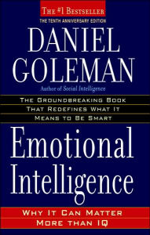
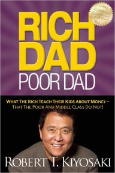

<!--

  Hey therefefsdf! This page is included as an example. Feel free to customize it for your own use upon downloading. Carry on!

-->
 

### How to Win Friends and Infuence People

Rating 9/10   

Excellent read.

 
### The Monk Who Sold His Ferrari

Rating 10/10  

WOW. 

 

### Emotional Intelligence - Daniel Goleman

Rating 8.5/10  

Very Interesting read. 

 

Rating 8.5/10  

Very Informative. 

 

Rating 8/10  

A funny little book. 

 

Rating (coming soon)  

 

Rating (coming soon) 

 

Rating (coming soon) 

 