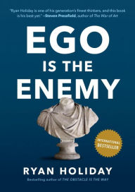
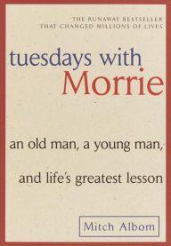

 

### How to Win Friends and Infuence People
 

**Rating 10/10**  
 

 This book is a top 5 favourite of most of my mentors and now I know why. A breathtaking and a magnificient read. Everything about this book is perfect.
 See my reading-notes [How to Win Friends and Infuence People - Dale Carnegie](https://alamgirqazi.github.io/blog/HowToWinFriendsandInfluencePeople)

### The Monk Who Sold His Ferrari
 

**Rating 10/10**   
 

Astonishing. Stupendous. Remarkable. This book will really blow your mind. See my reading-notes [The Monk Who Sold His Ferrari - Robin Sharma](https://alamgirqazi.github.io/blog/TheMonkWhoSoldHisFerrari)

### The Subtle Art of Not Giving a F*ck - Mark Manson
 

**Rating 9.5/10** 
 

A really phenomenal book. I've listened to a few of Mark Manson's podcasts and videos and read some of this articles and this guy is good. Like really, really good. 
See my reading-notes [The Subtle Art of Not Giving a F*ck - Mark Manson](https://alamgirqazi.github.io/blog/MarkManson)

 ### The Compound Effect - Darren Hardy

 

**Rating 9.5/10** 
 
See my reading-notes [The Compound Effect - Darren Hardy](https://alamgirqazi.github.io/blog/TheCompoundEffect)

### Think and Grow Rich - Napoleon Hill
 

**Rating 9.5/10** 
 
A Sensational book. They really mean it when they say it's one of the best Self-help book out there.
See my reading-notes [Think and Grow Rich - Napoleon Hill](https://alamgirqazi.github.io/blog/ThinkAndGrowRich)

### Ego is the enemy - Ryan Holiday
 

**Rating 9.5/10** 
 
Ryan Holiday is one of the best writers out there. I love his blogs and podcasts. He's the first person to introduce the stoic philosophy to me. This book from him is a masterpiece. Amazing insight on how to always stay humble and keep your ego in control. Ryan really is an inspiration for the new generation. 
See my reading-notes [Ego is the Enemy - Ryan Holiday](https://alamgirqazi.github.io/blog/EgoIsTheEnemy)

### Tuesdays with Morrie - Mitch Albom
 

**Rating 9/10** 
 
A very soul-stirring and poignant book for me.

### The Alchemist - Paulo Coelho
 

**Rating 9/10** 
  
A really fascinating story of Santiago who went out to search for hidden treasure. The Journey is more important than the destination.

### Tell me your dreams - Sidney Sheldon
 

**Rating 9/10** 
 
Amazeballs. Damn Sidney Sheldon knows how to tell a story. This novel made me fall in love with Fiction.

### Emotional Intelligence - Daniel Goleman
 

**Rating 8.5/10**   
 
Very Fascinating and absorbing research. Emotional Intelligence is indeed extremely essential.

### Rich Dad Poor Dad - Robert Kiyosaki
 

**Rating 8.5/10**   
 
Very Instructive and compelling read.

### Outliers | The Story of Success - Malcolm Gladwell
 

**Rating 8.5/10** 
 
A very spectacular read indeed. The concept of outliers is truly astonishing.

### The Tipping Point - Malcolm Gladwell
 

**Rating 8/10** 
 
A very riveting concept on how some things get so ubiquotous and some don't.

### Good to Great - Jim Collins
 

Rating (coming soon)
 

