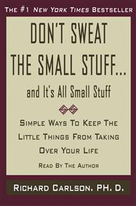
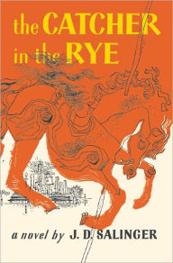
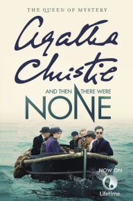
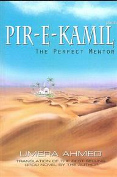

Top 5 books I've read (by genre)

 
 

# Top 5 Non-fiction Books

## 1. Don't Sweat The Small Stuff - Richard Carlson

 

---

## 2. How to Win Friends and Infuence People

 

---

## 3. The Subtle Art of Not Giving a F\*ck - Mark Manson

 

---

## 4. The Gifts of Imperfection - Brene Brown

 

---

## 5. The Monk Who Sold His Ferrari - Robin Sharma

 

---

### Notable mentions: The Magic of Thinking Big - David Schwartz

 

 

# Top 5 Fiction Books

## 1. 1984 - George Orwell

 

---

## 2. The Catcher in the Rye - JD Salinger

 

## 3. And Then There Were None - Agatha Christie

 

---

## 4. Pir e Kamil - Umera Ahmed

 

---

## 5. The Kite Runner - Khaled Hosseini

 

---

### Notable mentions: To Kill A Mockingbird - Harper Lee
